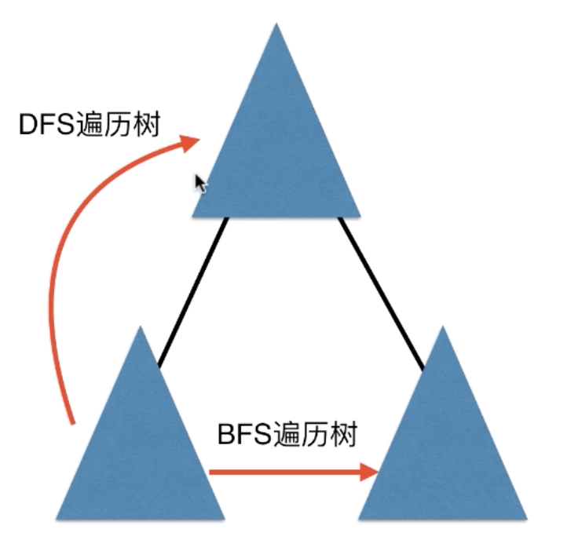

# 慕课网《玩转算法系列--图论精讲》笔记

明确变量的语义！！！

## 忘记的概念

### 图的基本表示

- 联通分量（2-2 8:13）
- 树是一种无环图（2-2 10:26）
- 联通的无环图是树（2-2 11:27）
- 联通图的生成树包含所有顶点（2-2 12:38）
- 通过删边可以使原本的联通图不在联通（2-2 14:40）
- 只有联通图才有生成树（2-2 15:20）
- 邻接表空间复杂度表示 O(V+E)，不能用 O(E)，当 E=0 的时候就不对了（2-7 05:11）
- 邻接表查询两点是否相邻优化：使用 HashSet（哈希表） 或者 TreeSet（红黑树）（2-7 13:35）
- 由于 Golang 中没有内置的 TreeSet 红黑树，这里就使用 map （哈希表）了 :/
- 可以使用深度优先遍历
    - 验证图是否联通、是否有环
    - 二分图检测
    - 寻找图中的桥
    - 寻找图中的割点
    - 哈密尔顿路径
    - 拓扑排序

---

### 深度优先遍历的应用

1. 求联通分量的个数 (4-1)

```text
visited[0 .. V] = false;

for (int v = 0; v < V; v ++) {
    if (!visited[v]) {
        dfs(v);
        // connected component
        cccount ++
    }
}
```

2. 求联通分量中包含的顶点 (4-2)

`visited` 数组记录每一个联通分量的 ID ，属于同一个联通分量的 vertex 有相同的 ID

```text
visited[0 .. V] = -1;

for (int v = 0; v < V; v ++) {
    if (!visited[v]) { // set ID
        dfs(v, ccid);
        ccid ++
    }
}
```

3. 求两个点是否在同一个联通分量重 (4-3)
4. 求两点之间的路径 (4-4, 单源路径问题)
5. 二分图检测
    - 二分图：定点 V 可以分成不想交的两个部分，所有边的两个端点隶属于不同部分

```text
0 - 1
0 - 2
3 - 1
3 - 2
4 - 1
6 - 2
6 - 5
```

---

### 关于广度优先遍历

使用广度优先遍历求得的路径即为最短路径，但是图必须为**无权图**

BFS 和 DSF 拥有一套相似的逻辑框架

```text
visited[0 ... V-1] = false

for (int v = 0; v < V; v ++) {
    if (!visited[v]) {
        search(v)
    }
}

func search(int s) {
    x.add(s)
    visited[s] = true
    while(!x.isEmpty()) {
        int v = x.remove();
        
        for (int w : G.adj(v)) {
            if (!visited[w]) {
                x.add(w)
                visited[w] = true
            }
        }

    }
}
```

---

## 第六章 floodfill

- [695](leetcode/l-695)
- [200](leetcode/l-200)
- [1020](leetcode/l-1020) 逆向思维，排除法
- [130](leetcode/l-130) 逆向思维，排除法
- [733](leetcode/l-733)   图像渲染 
- [1034](leetcode/l-1034) 边框着色
- [529](leetcode/l-529) 扫雷
- [827](leetcode/l-827) 最大人工岛 两步法解题

---

## 第七章 BFS

抽象状态和状态转移

- [1091](leetcode/l-1091) 二进制矩阵中的最短路径
- [752](leetcode/l-752)  打开转盘锁，使用图论建模
- [7-4一道智力题](traverse_graph/7-4-IQ-test) 倒水问题
- [7-4二道智力题](traverse_graph/7-4-IQ-test) 农夫运狼羊菜
- [773](leetcode/l-773) 滑动谜题  O(n!) ->  O(V + E) = O(V + 4V) = O(V) ，图总共有 n! 种可能 (\>O(2^n))

---

## 第八章 桥、割点、图的遍历树

桥：对于无向图，如果删除了一条边，整个图联通分量数量变化，则这条边称为桥(Bridge)，下图 3-5 的边

cut edge

```text
0 -- 2
|    |
1 -- 3
     |
4 -- 5
|    |
6 ---+
```

应用：交通系统、社交网络。一个图中可以有多个桥，一棵树的所有边都是桥

寻找桥的算法，使用 DFS

解决图论问题一般都是需要遍历图，只不过是记录不同的信息

### 判断桥

如何判断 v-w 是不是桥？通过 w ，能否从另外一条路回到 v 或者 v 之前的定点

1. 对于每一个定点，记录 DFS 的顺序，ord[v] 表示定点 v 在 DFS 中的访问顺序

```text
0 -- 2
|    |
1 -- 3
     |
4 -- 5
|    |
6 ---+
```

- ord[0] = 0
- ord[1] = 1
- ord[3] = 2
- ord[2] = 3
- ord[5] = 4
- ord[4] = 5
- ord[6] = 6

2. 对于每一个顶点,记录能到达的最小 ord

对于定点 2

- low[2] = 0
- low[3] = 0
- low[1] = 0

相邻节点所能到达的最小序号比当前节点小，则更新当前节点的 low 值

相邻节点的所能到达的最小序号比当前节点需要要大，为桥

[详细代码](cpt08-cut-edge-points/bridge.go)

---

### DSF 和 BFS 的遍历树

DSF 遍历树，图中非遍历树的边可以指向自己祖先的节点，而 BFS 遍历树中，非遍历树的边两端的点不是祖先的关系




---

### 割点

对于无向图，如果删除了一个顶点，(顶点邻边也删除)，整个图联通分量数量变化，则这个顶点称为割点 (Cut Points)

在无向联通图 G=(V,E)中: 若对于x∈V， 从图中删去节点x以及所有与x关联的边之后，G分裂成两个或两个以上不相连的子图，则称x为G的割点

下图，3 与 5 为割点

```text
0 -- 2
|    |
1 -- 3
     |
4 -- 5
|    |
6 ---+
```

---

## cpt9 哈密尔顿路径与回路

哈密尔顿回路：从一个点出发，沿着边行走，**经过每个顶点恰好一次**，之后再**回到出发点** 。

类似于 旅行推销员问题（Travelling Salesman Problem，**TSP**，带权图，完全图），求最短哈密尔顿回路

NP 难问题，无法在多项式时间内完成

[代码：哈密尔顿环](cpt09-hamiltonian)

[LeetCode: 980不同路径 III](leetcode/l-980)

对 'visited' 数组进行状态压缩，使用位运算
- `i` 是否为 1 ：visited && (1 << i) == 0
- 若 `i` 为 0，设为 1 ：visited + (1 << i)
- 若 `i` 为 1，设为 0 : visited - (1 << i)

记忆化搜索，记录 visited 和 currVertex 的状态 

---

## cpt10 欧拉路径和回路

从一个点出发,沿着边行走,经过每个边恰好一次,之后再回到出发点

### 证明存在

七桥问题

对于每一个点，进去一次，出去一次，“耗费两条边”

要想让每条边的都走一遍，回到原点，每个点都必须有进有出，每个点的相连边数(即每个点的度)必须是偶数

对于无向联通图：**每个点的度是偶数** <--->  图存在欧拉回路

证明：每个点的度是偶数 --> 图存在欧拉回路

从任一点出发,先随便找一个环。

如果这个环就是原图,已经找到了欧拉回路。

否则,剩下的边一定和我们找到的环相连,且所有顶点的度数依然是偶数,即依然存在环。两个相连的环,一定组成一个新环。

---

### 求路径

- 回溯法 指数级
- Fleury 算法 走不是桥的边 O((V+E)^2) --> O(E^2)
- Hierholzer 算法 O(V+E) --> O(E)

[Hierholzer 算法实现](cpt10-eulerloop/hierholzer-recursion.go)

- 先求深度优先遍历，求出每个节点的下一个节点是什么（可能有多个），每个边仅遍历一次
- 根据记录的信息，遍历多个环，同时合并它们，合并思路参考 [10-5](https://coding.imooc.com/lesson/370.html#mid=28975)


[0 3 4 6 7 9 10 8 7 5 2 1 5 4 1 0]

测试函数 [cpt10-eulerloop/hierholzer-recursion_test.go](cpt10-eulerloop/hierholzer-recursion_test.go)

---

### 欧拉路径

对于无向联通图，**除了两个点（起始点和终止点）**每个点的度是偶数图  <--> 存在欧拉回路

---

## cpt11 最小生成树

[相关代码](./cpt11-minimum-spanning-tree)

### 切分定理

将图中的点分成两个部分，称为一个 **切分**

如果一个边的两个端点,属于切分不同的两边,这个边称为 **横切边**

横切边中的最短边,属于最小生成树

---

### Kruskal

[相关代码](./cpt11-minimum-spanning-tree/kruskal.go)

Kruskal 算法思想：尽量使用短边(不能构成环)，贪心算法

借助 **并查集** 来检查环的存在 O(ElogE)

---

### Prim

操作切分，从 1 : V - 1 开始

每次找当前切分的最短横切边，扩展切分，知道没有切分

可以使用 **最小堆** 对算法进行优化 O(ElogE)

---

### 其他算法

- Prim 索引堆 O(ElogV)
- Fredman-Tarjan O(E + VlogV)
- Chazelle O(E*)

---

## cpt12 带权图最短路径

[相关代码](./cpt12-shortest-path)

### Dijkstra 算法

不能处理负权边

每轮循环

- 找到当前没有访问的最短路节点
- 确认这个节点的最短路就是当前大小
- 根据这个节点的最短路大小,更新其他节点的路径长度


[代码实现](./cpt12-shortest-path/dijkstra.go)

可以使用优先队列进行优化，降低时间复杂度

[代码实现](./cpt12-shortest-path/better-dijkstra.go)

---

### Bellman-Ford 算法

[代码实现](./cpt12-shortest-path/bellman-ford.go)

可求解负权边 `O(V*E)`

- 初始 dis[s] = 0, 其余 dis 值为无穷
- 对所有边进行一次松弛操作,则求出了到所有点,经过的边数最多为1的最短路
- 对所有边再进行一次松弛操作,则求出了到所有点,经过的边数最多为2的最短路
- 对所有边进行 V-1 次松弛操作,则求出了到所有点,经过的边数最多为 V-1 的最短路
- 进行第 v 次松弛操作，检测图中是否有负权环

当存在负权环时，没有最短路径。对于无向图，有负权边等同于有负权环

```txt
[0] -- 3 -- [2]
 |       /
 2    -6
 |   /          
[1]/
```

每一轮循环表示的是从起始点到当前点经过k个定点的最短路径，所以不能提前退出

优化：SPFA，使用队列

---

### Floyed 算法

[代码实现](./cpt12-shortest-path/floyed.go)

专门求所有点对最短路径

图的直径：所有点对最短路径中的最大值

比较：

|算法名称|时间复杂度|备注|
|:----:|:----:|:----:|
|Dijkstra|O(VElogE)|不能包含负权边|
|Bellman-Ford|O(V\*V\*E)|可以包含负权边；检测负权环|
|Floyed| O(V\*V\*V)|可以包含负权边；检测负权环|

第一重循环：需要绕道的点

检测负权环：dis[v][v] < 0 ?


---

## cpt13 有向图算法

[相关代码](./cpt13-directed-graph)

无向图是特殊的有向图

### 有向图的环检测 DAG

[代码实现](./cpt13-directed-graph/cycledetection.go)

DAG：Directed Acyclic graph

除了无向图的环检测所必须的操作外，还需要标记当前访问的路径

### 有向图的欧拉路径

入度等于出度

---

### 拓扑排序

[队列实现](./cpt13-directed-graph/topological-sort.go)

每次删除入度为 0 的点即可，同时，这个算法可以用来做有向图环检测

只有 DAG 才能进行拓扑排序

[深度优先遍历实现](./cpt13-directed-graph/topological-sort-2.go)

使用深度优先遍历的后序遍历。当访问完所有相关节点后再访问该节点

**缺点：不能进行环检测**

---

### 强联通分量

有向图联通。在一个强联通分量中，任何两点都可达

将所有强连通分量看作一个点，得到的有向图一定是DAG


每个联通分量先内部遍历，再按照拓扑排序逆序遍历


---

### Kosaraju 算法


如果一个强连通分量能够到一点(或是另一个强联通分量)

则翻转这张图后,进行后序遍历,这一点一定相较强邻通分量中的点后出现

则**翻转**这张图后,对于**后序**遍历的**逆**,这一点一定出现在这个强邻通分量中的点之前

所以，求强联通分量序列的算法为：

翻转图，求其后序遍历的逆，一定是强连通分量的拓扑排序的逆，然后求 Connected Component 即可

(代码摸鱼不写了)
